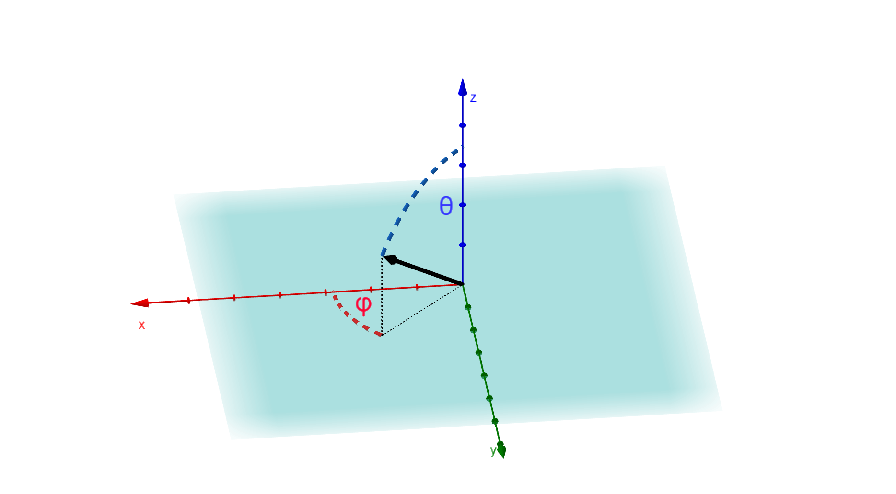
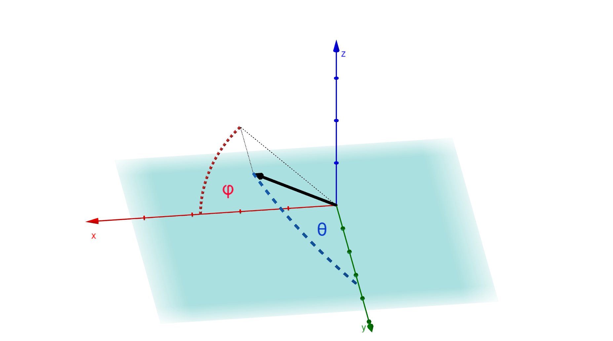

# Antenna Measurement Application

## Far-Field data convention
The AUT is always placed on x-y plane (z=0) with z being its normal vector. The testing region is z>0 only.
Namely there are two types of coordinate systems for plotting far-field data in the app:
* Elevation-over-Azimuth:

In this coordinate system θ = [0, π/2), φ = [0, 2π),

$`x = r \cdot \sin(\theta) \cdot \cos(\phi)`$

$`y = r \cdot \sin(\theta) \cdot \sin(\phi)`$

$`z = r \cdot \cos(\theta)`$

* Spherical:

In this coordinate system θ = [0, π), φ = [0, π),

$`x = r \cdot \sin(\theta) \cdot \cos(\phi)`$

$`y = r \cdot \cos(\theta)`$

$`z = r \cdot \sin(\theta) \cdot \sin(\phi)`$ 

## Far-Field data structure
The FF data is in elevation-over-azimuth coordinate system by default.
| θ | φ | Gain |
|----------|----------|----------|
| [rad]    | [rad]    | [dB] normalized    |
| [0, π/2]    | [0, 2π]    | [-240, 0]    |
| N is odd    | N is odd    |     |

**Note**: Since the near-field to far-field process will output data in elevation-over-azimuth coordinate system, data in spherical coordinate system is extracted by interpolation.
